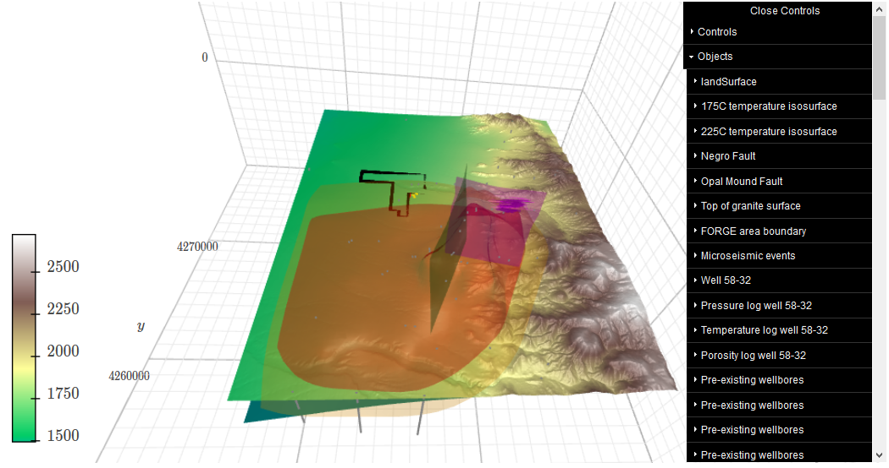

# Example of plotting 3D Geologic Model Using VTKPlotter

This binder notebook provides an example of using VTKPlotter to create a 3D geologic model that you can then embed in a website. 

The main notebook creates a model of a real geothermal reservoir in Utah that is part of a project called FORGE (Frontier Observatory for Research in Geothermal Energy).

All of the data is from the publicly available Geothermal Data Repository (https://gdr.openei.org/home) uploaded by the Energy and Geoscience Institute at the University of Utah.

1. Earthquake data: "Utah FORGE: Earthquake Catalog", https://gdr.openei.org/submissions/1039
2. Well 58-32  porosity log: "Utah FORGE: Well 58-32 Schlumberger FMI Logs DLIS and XML files", https://gdr.openei.org/submissions/1076
3. Well 58-32 pressure and temperature logs: "Utah FORGE: Milford Deep Test Well 58-32 (MU-ESW1) Pressure and Temperature Logs", https://gdr.openei.org/submissions/1101
4. Microseismic data: "Utah FORGE: Microseismic Events", https://gdr.openei.org/submissions/1151
5. Well data and surfaces data: "Utah FORGE: Well Data for Student Competition", https://gdr.openei.org/submissions/1111
